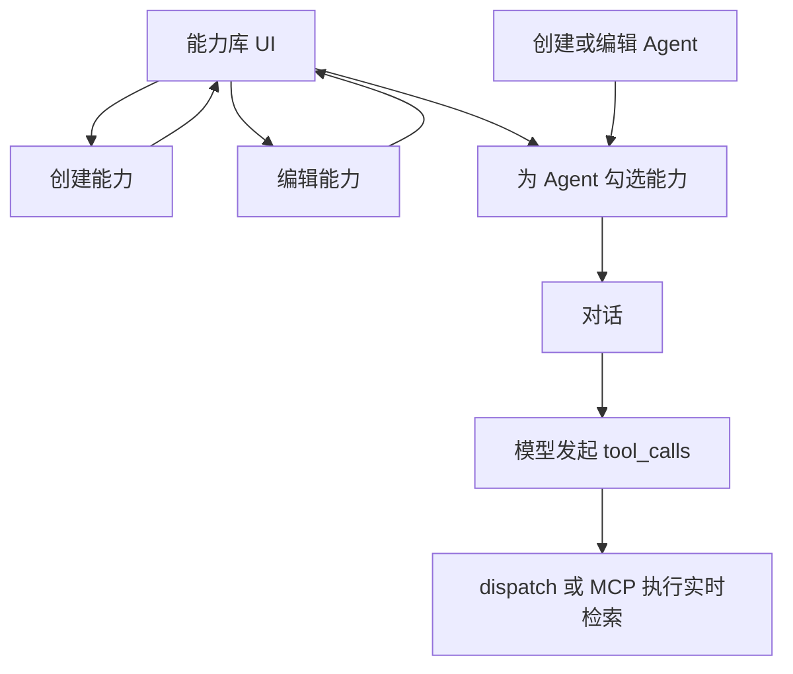

# Agent 能力体系：类型、UI 与端到端流程

> **执行状态**：草案（待 `Apps/agent-hub` 实施）  
> **关联批次**：[Plans/2026040402/执行方案.md](../2026040402/执行方案.md)（M1+/M2 对话与内置 Skill）；本文件为**新议题线**，不修改旧批次已定稿正文。

---

## 1. 用户问题

- 天气、某日大事等场景需要 **真实、实时检索**，不能仅靠模型泛泛回答。
- 需要 **UI 编辑能力**，含 **独立「创建能力」** 界面。
- 流程需明确：**创建 Agent → 选择能力（若无能力则先创建能力）→ 使用 Agent（必要时调用已赋能力）**。
- 需回答：**能力有哪些类型？分别对应什么 UI？**

---

## 2. 问题解析

- **范围**：在现有 `skills` / `agent_skills` 与 [chat.rs](Apps/agent-hub/src-tauri/src/hub/chat.rs) 工具链之上，扩展 **能力库管理**、**可配置连接器（T2）**、远期 **MCP（T3）**；与「按大模型分密钥」等纪律可并列，密钥存 keyring，不写入 `skills` 表明文。
- **约束**：未实现 `dispatch_tool` 分支的能力 **不得** 作为可选工具暴露，避免返回「未知工具」。
- **与旧决议关系**：沿用 [01-默认Agent与内置委派Skill.md](../2026040402/01-默认Agent与内置委派Skill.md) 中「必要 Skills」概念；本批次增加 **用户可选能力** 与 **创建能力** 产品面。

---

## 3. 解答 / 实现方案

### 3.1 端到端产品流程（目标态）

1. **能力库**：用户进入「能力」入口，查看已有能力；若无所需，**创建能力**（类型与 UI 见下表）。
2. **创建 / 编辑 Agent**：在表单中为该 Agent **勾选一项或多项能力**；**必要 Skills**（诚实声明、委派等）可默认勾选。
3. **使用 Agent**：模型按 tool 描述 **自主决定是否调用**；运行时 **HTTP（T2）或 MCP（T3）** 执行实时检索，结果回注多轮（现有 `run_chat_rounds` 可复用）。

### 3.2 能力类型与对应 UI

| 类型 | 含义 | 典型例子 | 对应 UI（建议） |
|------|------|----------|-----------------|
| **T1 系统内置·固定** | 随应用发布，无用户级密钥/URL | `honesty_acknowledge`、`request_agent_help` | **多选列表**（名称 + 说明 + 开关）；**无「创建能力」表单**（仅绑定/解绑） |
| **T2 系统内置·可配置（连接器）** | 固定 handler + 用户填 API Key、地区等 | 实时天气、新闻/百科检索 | **创建能力向导**：选模板 → 填配置 → 命名保存；列表 **编辑/删除** 实例 |
| **T3 MCP 能力** | 外部 MCP Server | 浏览器、数据库、自定义检索 | **连接表单**：启动方式、环境变量、鉴权、健康状态；与 `Apps/agent-hub` 中 **rmcp（M3）** 衔接 |
| ~~**T4 高级自定义**~~ | ~~HTTP + JSON Schema 低代码~~ | ~~私有 REST~~ | **本批次不纳入**：不设计、不实现「高级编辑器」；远期若需要再单独立项。 |

**数据关系（概念）**：

- **T1**：`skills` 全局行 + `agent_skills` 关联。
- **T2**：除 `skills` 外，通常需 **能力实例表或配置存储**（密钥用 keyring / 加密本地配置）；「创建能力」= 创建 **带配置的实例**。
- **T3**：独立连接表或扩展字段；运行时可走 MCP 客户端桥，不必全部进 `dispatch_tool` 的 `match`。

**「创建能力」UI**：主要对应 **T2、T3**（及可选 T4）；**T1** 仅在 Agent 编辑里 **勾选**。

**空态引导**：创建/编辑 Agent 时若无可用能力，提供 **「去创建能力」** 跳转。

### 3.3 当前代码基线（实施前）

- 表结构：[Apps/agent-hub/src-tauri/migrations/20260405000000_hub_batch_202602.sql](Apps/agent-hub/src-tauri/migrations/20260405000000_hub_batch_202602.sql)
- 运行时：[Apps/agent-hub/src-tauri/src/hub/chat.rs](Apps/agent-hub/src/hub/chat.rs) 中 `load_tools`、`dispatch_tool`
- 创建 Agent：[Apps/agent-hub/src-tauri/src/hub/agents.rs](Apps/agent-hub/src/hub/agents.rs) 仅 `attach_necessary_skills_tx`（T1 两类）；**无能力库 UI、无 agent 级多选、无 T2 实时检索**

### 3.4 建议落地顺序

1. **后端 API**：`skills_list`（可按类型过滤）；`agent_skills_get` / `agent_skills_set`；若上 T2，设计 **能力实例与密钥存储**。
2. **UI-A 能力库**：列表 + 创建能力（T2 先 1～2 个模板：天气 + 检索类）。
3. **UI-B Agent**：能力多选 + 空态引导「创建能力」。
4. **运行时**：T2 在 `dispatch_tool` 增加分支 + `reqwest`；错误信息对用户可读。
5. **MCP（T3）**：单独里程碑，接 rmcp 后再做连接类创建表单。

### 3.5 待决项（实现前需定案）

- **T2 配置粒度**：同一模板下，能力是 **每 Agent 一份** 还是 **全局一份多 Agent 共用**（影响表结构与 UI）。

---

## 4. 小结

- **能力类型**：T1 固定内置、T2 可配置内置（实时检索主力）、T3 MCP；**T4（高级 HTTP/低代码编辑器）本批次排除**。
- **UI 分工**：T1 勾选列表；T2 创建/编辑向导；T3 MCP 连接表单；**不包含** T4 高级编辑器。
- **流程**：能力库（含创建能力）→ 创建 Agent 并勾选 → 对话中按需 tool 调用 → 后端实时执行。

---

## 5. 修订记录

- 2026-04-06：从 Cursor 计划「Agent 能力来源与扩展」整理落盘，批次 `2026040601`。
