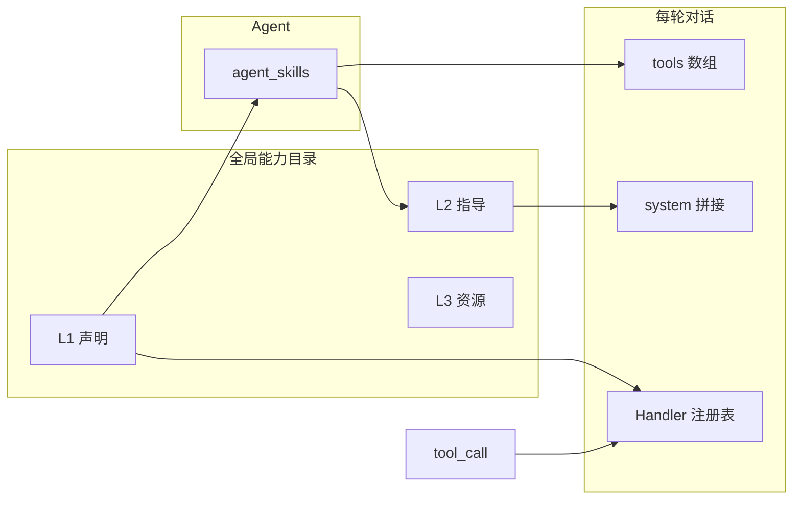

# 按 Agent Skills 范式：能力系统再设计

> **执行状态**：设计草案（未落地 `Apps/`）  
> **批次**：`2026041202`  
> **定位**：在**不绑定 Anthropic 云端 API** 的前提下，将 `agent-hub` 能力系统按 **Agent Skills 工程范式**（见 [02 §2.0](02-Anthropic-Agent-Skills对接设计.md)）**重新设计**；与 [01-Agent-Skills架构设计.md](01-Agent-Skills架构设计.md) 衔接，并细化到**可迁移的数据与运行时契约**。

---

## 1. 用户问题

- **按照 Agent Skills 范式，重新设计本项目的能力系统**——应包含哪些概念、分层、数据与运行时行为，以及与现有 `skills` / `agent_skills` / `chat.rs` 的演进关系。

---

## 2. 问题解析

### 2.1 范式要点（本项目采纳的抽象）

| 范式原则 | 在本项目中的含义 |
|----------|------------------|
| **渐进披露** | 能力信息分多层加载；**未绑定到 Agent 的 Skill 不进入**该 Agent 的「深度上下文」。 |
| **能力包** | 每个 Skill 是一个**版本化、可绑定**的单元；全局目录 + Agent 侧绑定表。 |
| **声明与执行分离** | **声明**：对模型暴露的 function 形态（`name` / `description` / `parameters`）；**执行**：`SkillHandler` 注册表，与声明解耦。 |
| **内置策略外置为运行时** | 产品级「不可协商」规则走 **system 后缀常量**（已有 `BUILTIN_RUNTIME_SYSTEM_SUFFIX` 模式），不混进 Skill 目录行的「必选位」。 |

### 2.2 与现有实现的关系（差距）

| 现状 | 范式缺口 |
|------|----------|
| `skills` 单行混放 `description` + `parameters_json`，近似只有「声明层」 | 缺少 **L2 指导正文**（流程、领域约束）的独立存储与按需注入 |
| `load_tools` 一次性把声明塞进请求 | 已绑定 Skill 的声明仍须出现；**L2** 应单独拼入 system，**可控长度** |
| `dispatch_tool` 巨型 `match` | 与 **声明与执行分离** 一致，应 **Registry** 化（[01 §5](01-Agent-Skills架构设计.md)） |

### 2.3 与 OpenAI 兼容 API 的关系（不矛盾）

- 本客户端仍使用 **DeepSeek 等 OpenAI 兼容 Chat Completions + `tools`**。
- **范式 ≠ 换掉 `tools`**：`tools[]` 仍是 **L1（声明层）** 对模型的接口形态；范式规范的是 **Skill 内部如何分层**、**system 如何组装**、**执行如何注册**。

---

## 3. 解答 / 目标架构

### 3.1 概念模型：Skill 三层（逻辑分层）

每个 **Skill** 在逻辑上拆为三层（可映射到列或表，见 §4）：

| 层级 | 名称 | 内容 | 典型负载 |
|------|------|------|----------|
| **L1** | **发现与声明** | `skill_id`、`display_name`、**对模型的** `tool_name`、**`description`**（兼作工具说明与 UI/发现文案；**不**再单列 `discovery_hint`）、`parameters_json` | 进入 `tools[]`；目录 API；**始终可列举**（全局） |
| **L2** | **指导与流程** | Markdown 或结构化正文：步骤、边界、与工具协作方式 | **仅当该 Skill 已绑定到当前 Agent** 时，注入 system（或独立 skill 块）；**可截断** |
| **L3** | **资源与附件**（可选） | 参考文档、模板、未来脚本路径、二进制资源 | 按需加载；**首轮可实现占位** |

**Agent Skills（绑定）**：`agent_skills` 表示 **Agent 启用哪些 `skill_id`**；仅这些 Skill 的 **L1 声明**进入当轮 `tools`，**L2** 进入当轮 system 片段（策略见 §5）。

### 3.2 端到端数据流（示意）

### 3.3 执行层：SkillRegistry（与 01 一致）

- **键**：`tool_name`（与 `skills.name` 一致）。
- **值**：`async fn` 或 trait 对象，入参为 JSON 与 `HubState` 上下文。
- **权限**：调用前仍通过 `agent_allows_tool_by_name`（或等价：绑定表 + 实例作用域）。

### 3.4 与 Anthropic 云端（可选）

- 若未来接入 Claude + 官方 Skills，**不改变**上述范式在**本地 Skill 模型**（DB 或文件）中的语义；仅增加 `kind = anthropic_remote` 与外部 `skill_id` 映射（见 [02](02-Anthropic-Agent-Skills对接设计.md)）。

---

## 4. 数据层再设计（演进建议）

### 4.0 存储介质：范式是否要求文件系统？

**结论：不要求。** Agent Skills **范式**规范的是**逻辑结构**（能力包、渐进披露、声明与执行分离），**不**规定持久化必须用某一种介质。

| 要点 | 说明 |
|------|------|
| **Anthropic 为何用文件系统** | 其运行时（代码执行容器、bash 读 `SKILL.md`）天然以**目录 + 文件**为 Skill 包载体；这是**其产品形态**，不是「凡称 Agent Skills 都必须落盘成文件夹」的公理。 |
| **本项目以 SQLite 为主** | `skills` / `agent_skills` 存 **L1**（列）与 **L2**（如 `instructions_md`），在语义上已对应范式中的「元数据 + 指导正文」分层；**读取时**按绑定关系做渐进加载即可，**与范式一致**。 |
| **是否需要改成「按范式 = 存文件」** | **不需要**为符合范式而整体迁移到文件系统。若以 DB 为唯一真源更简单（单用户桌面、备份、迁移一份 `agent-hub.db`），保持 SQLite **合理**。 |
| **何时引入文件** | **可选**：L3 大附件、`app_data/skills/{id}/` 放资源；**导入/导出**（zip、`SKILL.md` → 写入 DB）与生态互通；与 Claude Code 技能包**互操作**时再加强。首轮 **L3 占位**时仍可全在 DB（BLOB 或暂不实现）。 |

**一句话**：**逻辑上**贯彻 L1/L2/L3 与读取策略即可；**物理上** SQLite 行/列、文件、或混合，按工程与产品选，**不**存在「不按文件系统就不算范式」的硬性要求。

### 4.1 最小可行（推荐先做）

在现有 `skills` 表上**增量**（迁移）：

| 列 / 变更 | 说明 |
|-----------|------|
| `description` | **已决议**：**唯一** L1 说明列；同时用于 **OpenAI `tools` 的 `description`** 与 **UI/能力发现**（不再增加 `discovery_hint`）。 |
| `instructions_md` TEXT 可空 | **L2**：Markdown 指导正文；未绑定的 Agent **不**加载 |
| `kind` TEXT 可空 | `builtin_static` / `builtin_config` / `mcp` / `anthropic_remote` / …（与 [01 §4.2](01-Agent-Skills架构设计.md) 对齐） |

**兼容**：`instructions_md` 为空时，行为与当前一致（仅 L1）。

### 4.2 后续可选

- **L3** 独立表 `skill_assets(skill_id, role, path_or_blob_ref)` 或 `app_data` 下文件。
- **T2 实例**：`skill_instances` + 绑定到实例 id（[01 §4.2 M3](01-Agent-Skills架构设计.md)）。

### 4.3 `agent_skills`

- 保持 `(agent_id, skill_id)`；可选增加 `sort_order INTEGER` 仅 UI 排序。
- **不**再引入「必选」语义；策略见 [01 §3](01-Agent-Skills架构设计.md)。

---

## 5. 运行时层再设计（`chat.rs` 契约）

### 5.1 组装顺序（建议固定）

1. **Base system**：`agents.system_prompt`  
2. **内置 runtime 后缀**（常量）：诚实、工具边界等  
3. **L2 块（按绑定 Skill）**：对每个 `agent_skills` 中的 `skill_id`，若 `instructions_md` 非空，拼接 `【能力指导：{display_name}】\n{instructions_md}`**截断**至单 Skill 上限（如 2k–4k 字，可配置）  
4. **能力清单后缀**（已有 `build_capabilities_system_suffix`）：基于 `tools` 列表的条目摘要  

**多 Skill 时 L2 拼接顺序**：**已决议**——**暂不设规范**（任意顺序均可）；后续若需稳定顺序再引入 `sort_order` 或约定排序。

### 5.2 L2 与 `messages` 历史（已决议）

- **L2 指导仅注入当轮请求的 system**（与 base、runtime、能力清单等一起拼进**发给模型的** system），**不**作为独立 `messages` 行写入 SQLite `messages` 表。  
- **后续**优化对话 UI（例如展示「当轮生效能力指导」、折叠/摘要）时，再单独设计是否与历史同步展示；**本阶段不实现**。

### 5.3 `load_tools`

- 来源不变：`skills` JOIN `agent_skills`，仅 **L1** 字段参与 `ChatCompletionTool`。

### 5.4 `dispatch_tool`

- 替换为 **Registry** 查找；**禁止**未注册 `tool_name` 的静默成功。

---

## 6. 前端与产品

- **能力库 / 目录**：展示 L1 + 摘要；编辑 L2（若开放）用 Markdown 编辑器（远期）。
- **Agent 配置**：绑定仍为「选 Skill」；展示「已装载」列表；**会话侧常驻摘要**可引用 `description` + 绑定数量（与 [2026041201 未执行方案](../2026041201/未执行方案.md) 可合并）。

---

## 7. 落地顺序（与 01 对齐并细化）

| 步 | 内容 |
|----|------|
| 1 | **Registry** 化 `dispatch_tool`，行为与现有一致 |
| 2 | 迁移增加 `instructions_md`（及可选 `kind`）；**不**新增 `discovery_hint`（与 `description` 合并） |
| 3 | 实现 **L2 注入** 与截断策略；集成测试 |
| 4 | 能力库 UI 编辑 L2（可选） |
| 5 | L3 / 实例 / MCP 按 [01](01-Agent-Skills架构设计.md) 分期 |

---

## 8. 已决议与待决项

### 8.1 已决议（产品/设计）

| 议题 | 结论 |
|------|------|
| L2 与 `messages` 历史 | **暂不写入** `messages` 表；仅当轮 system 注入。对话 UI 专项优化时再说（见 §5.2）。 |
| `description` vs `discovery_hint` | **合并**：仅保留 **`description`**，同时服务 API `tools` 与 UI/发现（见 §4.1）。 |
| 多 Skill 时 L2 拼接顺序 | **暂不规定**（任意顺序均可）；需要时再定 `sort_order` 等（见 §5.1）。 |
| Skill **物理存储** | **不**为符合范式而弃用 SQLite；以 **DB 为真源**实现 L1/L2 与范式一致即可；文件系统为**可选**（L3、导入导出、互通），见 **§4.0**。 |

### 8.2 待决项

- （暂无；实现阶段可补充如 L2 单 Skill 截断字数默认值等工程参数。）

---

## 9. 关联文档

- [01-Agent-Skills架构设计.md](01-Agent-Skills架构设计.md) — 本仓库 Agent Skills 总纲
- [02-Anthropic-Agent-Skills对接设计.md](02-Anthropic-Agent-Skills对接设计.md) — 范式与厂商实现、可选云端对接
- [04-示例Skill-天气查询.md](04-示例Skill-天气查询.md) — 按本方案拆分的 **L1 / L2** 示例（`skill-builtin-weather`）
- [05-长对话与Skills状态一致性-缓解设计.md](../2026041301/05-长对话与Skills状态一致性-缓解设计.md) — 长历史与当前 Skills 不一致的**缓解策略**（批次 **`2026041301`**，已执行结案见 **05 §7**）
- [执行方案（已执行）.md](执行方案（已执行）.md) — 本批次 **L2/kind** 等落地对照
- [未执行方案.md](未执行方案.md) — 跨批次 **未执行** 累积（下一批须先读）
- [Plans/2026040601/01-Agent能力与UI能力库.md](../2026040601/01-Agent能力与UI能力库.md) — T1/T2/T3 产品面

---

## 10. 修订记录

| 日期 | 说明 |
|------|------|
| 2026-04-12 | 初稿：按 Agent Skills 范式重写能力系统（L1/L2/L3、数据演进、运行时组装、落地顺序）。 |
| 2026-04-12 | 已决议：L2 不写入 messages；`description` 与 `discovery_hint` 合并；L2 拼接顺序暂不规定。§8 改为已决议/待决项。 |
| 2026-04-12 | 新增 §4.0：范式不强制文件系统；SQLite 存 L1/L2 与范式一致；文件为可选。§8.1 补充存储决议。 |
| 2026-04-12 | §9 增加示例 Skill 文档 `04-示例Skill-天气查询.md`。 |
| 2026-04-12 | §9 增加 `执行方案（已执行）.md`、`未执行方案.md` 链接。 |
| 2026-04-13 | §9 增加 `05`（后迁至批次 **`2026041301`**，链接 **[`../2026041301/05-…`](../2026041301/05-长对话与Skills状态一致性-缓解设计.md)**）。 |
